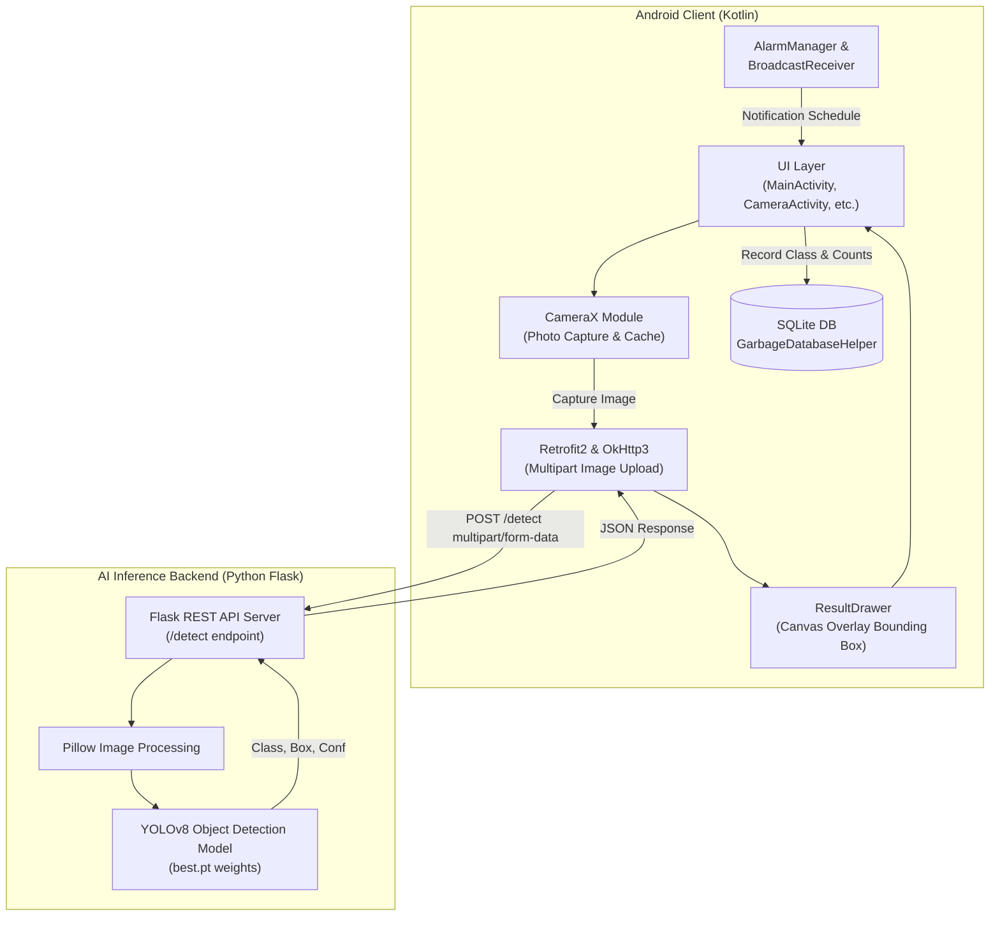

# ♻️ TrashCam (AI-Cam)
> **AI 기반 다국어 재활용 및 분리수거 가이드 안드로이드 애플리케이션**  
> *AI Camera app for foreigners to help and educate them about waste separation in Korea.*

<p align="center">
  
  
  
  
  
  
  
  
</p>

---

## 📌 목차 (Table of Contents)
1. [프로젝트 소개](#-프로젝트-소개-overview)
2. [주요 기능](#-주요-기능-key-features)
3. [시스템 아키텍처](#-시스템-아키텍처-system-architecture)
4. [기술 스택](#-기술-스택-tech-stack)
5. [프로젝트 구조](#-프로젝트-구조-project-structure)
6. [API 명세](#-api-명세-api-specification)
7. [설치 및 실행 가이드](#-설치-및-실행-가이드-getting-started)
8. [화면 구성 및 사용자 시나리오](#-화면-구성-및-사용자-시나리오)

---

## 📖 프로젝트 소개 (Overview)

대한민국의 분리수거 제도는 종량제 봉투 사용, 투명 페트병 별도 배출, 공병 보증금 제도, 재활용 불가 일반 쓰레기 구분 등 전 세계적으로도 가장 세분화되어 있어, 국내 거주 외국인이나 다문화 가정이 올바른 배출 요령을 숙지하는 데 어려움을 겪습니다.

**TrashCam (AI-Cam)** 은 스마트폰 카메라로 쓰레기나 재활용품을 촬영하면 **YOLOv8 딥러닝 객체 탐지 모델**이 대상을 즉시 인식하여, **4개 국어(한국어, 영어, 중국어, 일본어)** 로 올바른 배출 지침과 업사이클링 팁을 안내하는 스마트 친환경 도우미 앱입니다.

---

## ✨ 주요 기능 (Key Features)

### 1. 📷 실시간 AI 쓰레기 인식 및 시각화 (CameraX & YOLOv8)
- **CameraX** 기반 고화질 카메라 촬영 및 디스크 캐싱.
- 딥러닝 서버 전송 후 탐지된 객체의 위치(Bounding Box), 라벨명, 신뢰도(Confidence %)를 원본 사진 위에 오버레이 렌더링 (`ResultDrawer`).
- 투명 페트병(`Plastic bottle`), 비닐류(`Poly bag`), 종이류(`Paper`), 소주 공병(`Soju`) 등 주요 재활용 품목 분류.

### 2. 🌐 4개 국어 다국어 지원 (Multilingual Support)
- 외국인 맞춤형 UI 지원: **한국어(KO), 영어(EN), 중국어(ZH-rCN), 일본어(JA)**.
- 앱 내 드로어(Navigation Drawer) 메뉴를 통해 실시간 원클릭 언어 전환 (`AppCompatDelegate.setApplicationLocales`).
- 모든 안내 문구, 분리배출 방법, 팁, 알림 메시지가 선택된 언어로 실시간 반영.

### 3. 📋 품목별 맞춤 분리배출 가이드 & 유튜브 팁 (Recycling Guide & Tips)
- **배출 요령 상세 안내**: 세척, 라벨/뚜껑 분리, 압축, 배출 장소(전용 수거함 vs 종량제 봉투) 안내.
- **YouTube 업사이클링/재활용 영상 연동**:
  - 페트병: 화분 만들기, 조명 제작, 정리수납 아이디어 영상.
  - 비닐류: 재활용 문패 만들기, 비닐봉투 정리 팁.
  - 종이류: 종이 팔찌, 쇼핑백으로 각티슈 케이스 만들기 등.
  - 고화질 유튜브 썸네일 제공 및 클릭 시 관련 영상으로 다이렉트 연결.

### 4. 🍾 소주 공병 보증금 리포트 & 도장판 쿠폰 (Deposit Profit Report)
- 소주병(`Soju`) 인식 시 자동으로 SQLite DB 누적 카운트.
- **공병 환급금 자동 계산**: 1병당 100원의 환급금을 실시간 계산하여 누적 획득 금액 표시.
- **스탬프 쿠폰 시스템**: 10병 단위로 채워지는 시각적 도장판(Stamp Board) 그리드 UI 제공.

### 5. 📊 분리수거 통계 대시보드 (Statistics Dashboard)
- SQLite (`GarbageDatabaseHelper`)를 통해 사용자별 배출 품목 누적 데이터베이스 관리.
- **MPAndroidChart** 막대그래프(BarChart)를 적용하여 가장 많이 배출한 쓰레기 TOP 랭킹 시각화.

### 6. ⚠️ 헷갈리기 쉬운 쓰레기 상식 가이드 (Mistake Guide)
- 재활용으로 착각하기 쉬운 일반 쓰레기 6가지 항목 안내:
  1. *오염된 용기* (기름/양념 묻은 라면 용기 등)
  2. *영수증* (감열지)
  3. *치킨 뼈 / 생선 가시*
  4. *빨대* (작은 플라스틱/오염 종이)
  5. *깨진 유리* (신문지 포장 종량제 배출)
  6. *코팅 전단지*
- 카드 클릭 시 상세 분리배출 팝업 다이얼로그 제공.

### 7. ⏰ 분리수거 요일별 정밀 알람 (Alarm Scheduler)
- `AlarmManager`를 사용해 배출 요일(월~일 Chip 다중 선택) 및 배출 시간(TimePicker) 설정.
- `setExactAndAllowWhileIdle` 적용으로 절전 모드(Doze mode)에서도 정확한 시간에 알림 발송.
- 기기 재부팅 시 `BootReceiver`를 통해 기존 설정 알람 자동 재등록.

---

## 🏗 시스템 아키텍처 (System Architecture)



---

## 💻 기술 스택 (Tech Stack)

### Android Client
| 분류 | 기술 / 라이브러리 | 설명 |
|---|---|---|
| **Language** | Kotlin 1.9+ | 주요 개발 언어 |
| **Android SDK** | Min SDK 24 / Target SDK 36 | 광범위한 기기 호환성 및 최신 Android 14+ 대응 |
| **UI Framework** | ViewBinding, DataBinding, Material Design 3 | 뷰 바인딩 및 Material UI 컴포넌트 |
| **Camera** | AndroidX CameraX (1.3.4) | 카메라 하드웨어 제어, 미리보기, 사진 캡처 |
| **Networking** | Retrofit 2.9.0, OkHttp 4.12.0, Gson | 비동기 HTTP/REST API 통신 및 JSON 직렬화 |
| **Concurrency** | Kotlin Coroutines (`lifecycleScope`, `Dispatchers.IO`) | 비동기 백그라운드 처리 |
| **Image Loading** | Bumptech Glide (4.16.0) | 이미지 및 유튜브 썸네일 캐싱 & 로딩 |
| **Data Visualization** | MPAndroidChart (v3.1.0) | 분리수거 통계 막대그래프 |
| **Database** | SQLite (`SQLiteOpenHelper`) | 분리수거 이력 및 통계 로컬 영속화 |
| **Scheduler** | Android AlarmManager, BroadcastReceiver | 배출 요일/시간 푸시 알림 |

### AI & Backend Server
| 분류 | 기술 / 라이브러리 | 설명 |
|---|---|---|
| **Framework** | Flask (Python) | 경량 RESTful API 서버 |
| **Model** | Ultralytics YOLOv8 | 쓰레기 객체 탐지(Object Detection) 모델 |
| **Image Engine** | Pillow (PIL) | 이미지 바이트 스트림 파싱 및 변환 |
| **Network Tunnel** | ngrok | 모바일 디바이스와의 실시간 외부 터널링 연결 |

---

## 📁 프로젝트 구조 (Project Structure)

```
AI-Cam/
├── Flask.py                            # Flask 백엔드 YOLOv8 추론 서버
├── build.gradle.kts                    # 프로젝트 루트 빌드 스크립트
├── settings.gradle.kts                 # 프로젝트 설정 및 저장소 정의
├── app/
│   ├── build.gradle.kts                # 앱 모듈 빌드 및 의존성 설정
│   └── src/
│       ├── main/
│       │   ├── AndroidManifest.xml     # 앱 권한, 액티비티 및 리시버 등록
│       │   ├── java/com/example/
│       │   │   ├── UIDesign/           # 메인 UI & 프래그먼트
│       │   │   │   ├── MainActivity.kt # 메인 화면, 언어 드로어, 팁 롤링 배너
│       │   │   │   ├── FirstFragment.kt
│       │   │   │   └── SecondFragment.kt
│       │   │   ├── camera/             # 카메라 및 결과 안내
│       │   │   │   ├── CameraActivity.kt         # 카메라 캡처, 서버 통신, 결과 처리
│       │   │   │   ├── CameraHandler.kt          # CameraX 제어 핸들러
│       │   │   │   ├── CameraUiManager.kt        # 카메라 화면 UI 상태 제어
│       │   │   │   ├── RecyclingGuide.kt         # 품목별 다국어 지침 데이터 매핑
│       │   │   │   ├── RecyclingResultActivity.kt # 결과 확인 및 배출 가이드 화면
│       │   │   │   └── RecycleTipActivity.kt     # 유튜브 재활용 활용 팁 리스트
│       │   │   ├── flask/              # 백엔드 API 연동 모듈
│       │   │   │   ├── ApiService.kt             # Retrofit 인터페이스 (uploadImage)
│       │   │   │   ├── RetrofitClient.kt         # Retrofit 싱글톤 인스턴스
│       │   │   │   └── ResultDrawer.kt           # 탐지 바운딩 박스 캔버스 렌더링
│       │   │   ├── db/                 # 로컬 데이터베이스 & 통계
│       │   │   │   ├── GarbageDataHelper.kt      # SQLiteOpenHelper (배출 기록 DB)
│       │   │   │   ├── StatisticsActivity.kt     # MPAndroidChart 통계 화면
│       │   │   │   ├── ProfitReportActivity.kt   # 공병 환급금 및 스탬프 쿠폰 화면
│       │   │   │   └── StampAdapter.kt           # 스탬프 그리드 어댑터
│       │   │   ├── guideline/          # 실수하기 쉬운 쓰레기 가이드
│       │   │   │   └── MistakeGuideActivity.kt   # 일반 쓰레기 6선 그리드 뷰
│       │   │   ├── alarm/              # 분리수거 알림
│       │   │   │   ├── AlarmSettingsActivity.kt  # 요일/시간 알람 설정 화면
│       │   │   │   ├── AlarmReceiver.kt          # 알람 시점 노티피케이션 발행
│       │   │   │   └── BootReceiver.kt           # 기기 부팅 시 알람 복원 리시버
│       │   │   └── video/              # 비디오 관련 UI
│       │   │       └── VideoTipAdapter.kt        # 재활용 영상 리사이클러뷰 어댑터
│       │   └── res/
│       │       ├── values/strings.xml          # 한국어 (기본)
│       │       ├── values-en/string.xml        # 영어 리소스
│       │       ├── values-zh-rCN/strings.xml   # 중국어 간체 리소스
│       │       └── values-ja/strings.xml       # 일본어 리소스
```

---

## 📡 API 명세 (API Specification)

### 1. 객체 탐지 (Object Detection)
- **URL**: `/detect`
- **Method**: `POST`
- **Content-Type**: `multipart/form-data`

#### 요청 파라미터 (Request)
| 필드명 | 타입 | 설명 |
|---|---|---|
| `image` | File (Binary) | 카메라로 촬영한 JPEG/PNG 이미지 파일 |

#### 응답 예시 (Response: `200 OK`)
```json
{
  "detections": [
    {
      "classId": 0,
      "className": "Plastic bottle",
      "confidence": 0.9245,
      "boxNormalized": [0.1245, 0.2312, 0.6542, 0.7891]
    }
  ]
}
```

- `boxNormalized`: `[xmin, ymin, xmax, ymax]` (0.0 ~ 1.0 범위로 정규화된 좌표)

---

## 🚀 설치 및 실행 가이드 (Getting Started)

### 1. Flask AI 추론 서버 실행 (Backend)
1. **Python 환경 설정** (Python 3.8 이상 권장)
   ```bash
   python -m venv venv
   source venv/bin/activate  # Windows: venv\Scripts\activate
   ```
2. **필수 라이브러리 설치**
   ```bash
   pip install flask ultralytics pillow
   ```
3. **가중치 파일(`best.pt`) 경로 설정**
   - `Flask.py` 파일의 `MODEL_PATH` 변수를 학습된 YOLOv8 모델 가중치 파일 경로로 수정합니다.
   ```python
   MODEL_PATH = "weights/best.pt"  # 모델 파일 경로 지정
   ```
4. **Flask 서버 구동**
   ```bash
   python Flask.py
   # 서버가 0.0.0.0:5000 포트에서 실행됩니다.
   ```
5. *(선택)* **ngrok을 통한 외부 터널링**
   ```bash
   ngrok http 5000
   # 생성된 Forwarding URL(예: https://xxxx.ngrok-free.dev/)을 복사합니다.
   ```

### 2. 안드로이드 앱 빌드 및 실행 (Client)
1. **Android Studio**에서 본 프로젝트를 엽니다.
2. `app/src/main/java/com/example/flask/RetrofitClient.kt` 파일을 열고 서버 주소를 업데이트합니다:
   ```kotlin
   // 로컬 테스트(에뮬레이터): "http://10.0.2.2:5000/"
   // 로컬 테스트(실제 기기): "http://<내_PC_IP>:5000/"
   // ngrok 사용 시: "https://<ngrok-domain>.ngrok-free.dev/" (마지막 '/' 필수)
   private const val BASE_URL = "https://your-server-url.ngrok-free.dev/"
   ```
3. 프로젝트를 Sync Gradle하고 디바이스 또는 에뮬레이터에서 실행(Run)합니다.

---

## 📱 화면 구성 및 사용자 시나리오

1. **메인 화면 (MainActivity)**
   - 상단 언어 선택 버튼을 눌러 한국어 / English / 中文 / 日本語 중 원하는 언어로 변경.
   - 중앙의 5초 주기 롤링 배너를 통해 일상 속 분리배출 꿀팁 확인.
   - [카메라], [통계], [알람 설정], [공병 성과 리포트], [오분리 가이드] 버튼을 통해 각 기능 진입.

2. **카메라 촬영 및 분석 (CameraActivity)**
   - 카메라 뷰파인더로 재활용품을 비추고 [촬영] 버튼 클릭.
   - 백엔드 서버로 이미지를 전송하여 YOLOv8 추론 진행.
   - 화면에 초록색 사각형과 품목명/정확도가 표시됨.
   - **소주병(`Soju`) 인식 시**: 3초 동안 라벨을 보여준 뒤 자동으로 DB에 1병 카운트가 저장되며 **성과 리포트** 화면으로 이동.
   - **기타 품목(`Plastic bottle`, `Paper` 등) 인식 시**: [자세히 보기] 버튼을 클릭하여 상세 지침 화면으로 이동.

3. **결과 확인 및 유튜브 팁 (RecyclingResultActivity & RecycleTipActivity)**
   - 해당 품목의 올바른 배출 요령(세척, 분리, 배출처) 텍스트 제공.
   - 하단 유튜브 썸네일 클릭 시 공식 재활용 교육 영상으로 이동.
   - [활용 방법] 클릭 시 DIY 업사이클링 동영상 목록(화분, 조명 만들기 등) 열람.

4. **공병 성과 리포트 (ProfitReportActivity)**
   - 인식된 소주병의 총 누적 개수와 병당 100원 환산 환급금(`총 x,xxx원 획득!`) 확인.
   - 10개 단위 스탬프 보드로 친환경 실천에 대한 게이미피케이션(동기부여) 제공.

5. **분리수거 통계 (StatisticsActivity)**
   - MPAndroidChart 막대그래프로 내가 가장 자주 배출한 쓰레기 순위 시각화.

6. **알람 설정 (AlarmSettingsActivity)**
   - 거주 지역의 배출 요일(예: 화/목/일) 및 배출 시간대를 등록하여 잊지 않고 쓰레기를 배출하도록 푸시 알림 수신.

---

## 👥 기여 및 라이선스 (License)
- 본 프로젝트는 거주 외국인의 한국 분리수거 적응과 올바른 재활용 문화 정착을 돕기 위해 개발되었습니다.
- Repository: [mingyuBack/AI-Cam](https://github.com/mingyuBack/AI-Cam)
